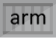

# Registry Artifact Types

## Overview

Examples for how  artifact types can leverage [OCI Mmanifest](https://github.com/opencontainers/image-spec/blob/master/manifest.md) and [OCI Index](https://github.com/opencontainers/image-spec/blob/master/image-index.md) to represent their types. These examples demonstrate the benefits for leveraging `manifest` to represent a specific type, leaving `index` for collections of mixed artifacts. 

The proposal uses additional `mediaTypes`, to express the type of artifact, and the layers and proposes `mediaType` is a required field. However, the specific values are extensible.


## Proposal

Docker brought great usability to the evolving container ecosystem by providing end to end experiences. These experiences included a registry storing secured, layered, optional signed, images.

The experience to call `docker run [registry]/image:[version]` turns out to be productive and powerful, and not limited to just container images.

As new artifacts evolve, storing them in a registry for easy referencing turns out to be just as powerful. 

**Helm example**

```sh
helm upgrade myBlog demo42.azurecr.io/helm/wordpress:1.0 
    --reuse-values \
    --set wordpressBlogName=myBlog
```

**CNAB example**

```sh
duffle install myBlog demo42.azurecr.io/cnab/wordpress:1.0 
```

**Azure example**

```sh
az deployment create demo42.azurecr.io/arm/wordpress:1.0
```

**aws example**

```sh
aws ecs run-task --task-definition demo42.dkr.ecr.us-east-1.amazonaws.com/wordpress:1.0
```


## Manifest and Index
The [OCI image-spec](https://github.com/opencontainers/image-spec/) expresses two top level objects:

- [OCI Mmanifest](https://github.com/opencontainers/image-spec/blob/master/manifest.md): 
  Represents a specific artifact, usually specific to a platform and architecture.
- [OCI Index](https://github.com/opencontainers/image-spec/blob/master/image-index.md): Represents a collection of artifacts, typically pivoted on a platform and architecture. For container images, a windows, linux and arm version could be listed. 

Consumers can express either a manifest or an index by a `:tag` reference:

- `demo42.azurecr.io/samples/images/hello-world:1.0`

The above reference could represent windows, linux, arm, or it could represent a multi-arch image. 

Additional tags might be represented as:
- `demo42.azurecr.io/samples/images/hello-world:1.0-windows`
- `demo42.azurecr.io/samples/images/hello-world:1.0-linux`
- `demo42.azurecr.io/samples/images/hello-world:1.0-arm`


In this case, executing `docker run demo42.azurecr.io/samples/images/hello-world:1.0` will cause the docker client to pull the manifest for the `:1.0` reference. Since this is a multi-arch manifest, the docker client will process the manifest, find the platform that matches, and make a subsequent request for the digest that represents: `demo42.azurecr.io/samples/images/hello-world:1.0-linux`

This flow works well for multi-arch scenarios. The index represents a collection of images. 
### Registry Listing
A registry listing, could be visualized as:

| tags | icon[s] | type | actions|
|-|-|-|-|
| `samples/image/hello-world:1.0` |  | container image | `docker run ...` |
| `samples/image/hello-world:1.0-windows` || container image | `docker run ...` |
| `samples/image/hello-world:1.0-linux` || container image | `docker run ...` |
| `samples/image/hello-world:1.0-arm` || container image | `docker run ...` |


## Leveraging Registries for Additional Artifacts

The major cloud vendors have implemented [docker/distribution](https://github.com/docker/distribution) to support the registry api, implementing their cloud specific storage and security semantics. Additional products and projects like [Codefresh](https://codefresh.io/), [JFrog](https://jfrog.com/), [Harbor](https://goharbor.io/) have built experiences around [docker/distribution](https://github.com/docker/distribution).

With the volume of development and production activity, these registries are hardened, secured & highly scalable and available.

By evolving registries to support additional artifact types, customers and cloud vendors can leverage their existing registry investments.


## Understanding Artifact Types

If we assume registries can host various artifact types, the next set of question include:

- How does one reason over the various artifact types in a registry?
- How would a registry listing represent the different artifact types? 
  - Can a registry show an icon and/or a short text identifier? 
- If a registry listings wishes to provide optimized action points, such as gestures to deploy Helm Chart, ecs task, or deploying an image directly to a container service; how would the UI know which actions to surface on which artifact types?
- How would vulnerability scanners know how to scan the various artifacts? Would scanners perform different scanning routines, based on the artifact type? How do they know the type?

## Registry Listing

While tools should have knowledge of the artifacts they work with, so should a registry. By providing information on the artifact, registries can display artifacts, with context and details.


**Registry:** `demo42.azurecr.io`

| artifact reference | icon | type | actions|
|-|-|-|-|
| `samples/image/hello-world:1.0` || container image | `docker run ...` |
| `samples/helm/hello-world:1.0` ||  helm chart | `helm install ...` |
| `samples/cnab/hello-world:1.0` || CNAB | `duffle install ...` |
| `samples/arm/hello-world:1.0` || arm | `az deployment create ...` |
| `samples/ecs-task/hello-world:1.0` || ecs-task | `aws ecs create-service ...` |

## image-spec Evolvement

The [OCI Image-spec](https://github.com/opencontainers/image-spec/) provides great flexibility for storing image layers, including the ability to store multi-arch images in a single index. 

While it's possible to store anything in these layers, having deterministic understanding of the type enables great experiences.

### Copying mediaType for additional artifacts

While several discussions have considered copying the existing [oci mediaTypes](https://github.com/opencontainers/image-spec/blob/master/media-types.md) to represent different artifact types, this approach conflates the persistence format with the actual artifact type. 

- ` "mediaType": "application/vnd.cncf.helm.chart.v1+json" `
- ` "mediaType": "application/vnd.deislabs.cnab.chart.v1+json" `

Expanding the media types requires registries to understand these new media types and how to validate them.

### Using annotations for additional artifacts

Other options considered [annotations](https://github.com/opencontainers/image-spec/blob/master/annotations.md) to describe the new artifact. 

```json
"annotations": {
    "io.cnab.component_name": "component-2",
    "com.docker.app.format": "cnab",
    "io.cnab.keywords": "[\"keyword1\",\"keyword2\"]",
    "io.cnab.runtime_version": "v1.0.0-WD",
    "io.cnab.type": "io.docker.app",
```

Annotations are great for optional search results and details of an artifact. However, annotations are optional, making it a little too unstructured to provide deterministic definitions of the objects within a registry.

While annotations can be fit within the pre-release OCI image-spec, it's proposed this is the time to evolve the spec to decouple persistance formating from artifact declaration.

## Decoupling Persistance Format from Artifact Type

The [OCI image-spec](https://github.com/opencontainers/image-spec/) expresses mediaTypes to define the persistance of an **OCI Image**. In this proposal, mediaTypes are more generic, expressing the hierarchy of persistance, regardless of the specific type. A new required `artifactType` is added, providing deterministic definition of the artifact.

By decoupling persistance from the type, a registry may persist the artifact without needing to know the artifactType. As long as the artifact follows the validated structure of the renamed [OCI medaiTypes](https://github.com/opencontainers/image-spec/blob/master/media-types.md), the object can be persisted. 

### Persistance based mediaTypes

The renamed, OCI mediaTypes have `image` removed to represent persistance format, leaving artifact type to a new property.

| MediaType | Usage |
|-|-|
|`application/vnd.oci.index.v1+json` | OCI Index |
|`application/vnd.oci.manifest.v1+json` | OCI Artifact Manifest |
|`application/vnd.oci.layer.v1.*` | OCI Layer |

### Artifact Type

To decouple persistance from artifact identification, a new required `artifactType` is proposed.

- **`artifactType`** *string*
  This property is REQUIRED, identifying the object the manifest represents. 

The following are proposed artifactTypes
| ArtifactType | Display Name | Info | 
|-|-|-|
|`application/vnd.oci.image.index.v1` | OCI Multi-Arch Image | [Docker](https://www.docker.com/products/docker-desktop) *|
|`application/vnd.oci.image.manifest.v1` | OCI Image | [Docker](https://www.docker.com/products/docker-desktop) * |
|`application/vnd.cncf.helm.manifest.v3` | Helm | [Helm](https://helm.sh)
|`application/vnd.deislabs.cnab.manifest.v1` | CNAB | [Duffle](https://cnab.io), [Docker-application](https://www.docker.com/search/node?keys=docker-application)|
|`application/vnd.microsoft.arm.manifest.v1`| ARM | [Azure CLI](https://docs.microsoft.com/en-us/cli/azure/?view=azure-cli-latest) |
|`application/vnd.aws.ecs.task.manifest.v1`| ECS Task | [aws Task](https://docs.aws.amazon.com/AmazonECS/latest/developerguide/task_definitions.html)|

*\* most registry providers automatically convert `oci.image` manifests to the format requested by the client.*

> See: [mediaTypes & artifactTypes](https://github.com/SteveLasker/RegistryArtifactTypes/blob/master/mediaTypes.md) for more details

## OCI Artifact Examples

As quick reference, the following are provided as examples:

- [OCI Image](#OCI-Image)
- [Helm Chart](#Helm-Chart)
- [CNAB](#CNAB)

### OCI Image

A modified version of [image-manifest](https://github.com/opencontainers/image-spec/blob/master/manifest.md#example-image-manifest)
```json
{
  "schemaVersion": 2,
  "mediaType": "application/vnd.oci.manifest.v1+json",
  "artifactType": "application/vnd.oci.image.manifest.v1",
  "config": {
    "mediaType": "application/vnd.oci.config.v1+json",
    "artifactType": "application/vnd.oci.image.config.v1",
    "size": 16078,
    "digest": "sha256:bd698aa18aa02a2f083292b9448130a3afaa9a3e5fba24fc0aef7845c336b8ad"
  },
  "layers": [
    {
      "mediaType": "application/vnd.oci.layer.v1.tar+gzip",
      "artifactType": "application/vnd.oci.image.layer.v1",
      "size": 23133155,
      "digest": "sha256:9a1a13172ed974323f7c35153e8b23b8fa1c85355b6b26cc3127e640e45ef0aa"
    },
    ...
```

## Helm Chart
> **Note:** *this is just an illustrative example of the power of decoupling artifactTypes from mediaTypes.*

> The persistance format has yet to be decided by the Helm community, the following represents what a Helm chart *could* be expressed as.

Unlike OCI Image manifests, Helm charts use layers to represent different elements of a chart. The files that make up the chart are separated from the values file *(parameter values)*. By separating values, multiple deployments of the same chart, only differentiated by the values, may be tracked and evaluated by new Helm tools.

**Helm manifest example**

`helm install demo42.azurecr.io/samples/helm/wordpress:0.1.0`

```json
{
  "schemaVersion": 2,
  "mediaType": "application/vnd.oci.manifest.v1+json",
  "artifactType": "application/vnd.cncf.helm.v3",
  "config": {
    "mediaType": "application/vnd.oci.config.v1+json",
    "artifactType": "application/vnd.cncf.helm.config.v3",
    "size": 7023,
    "digest": "sha256:b5b2b2c507a0944348e0303114d8d93aaaa081732b86451d9bce1f432a537bc7",
    "annotations": {
      "org.opencontainers.title": "wordpress",
      "org.opencontainers.version": "0.1.0"
    },
    "manifests": [
      {
        "mediaType": "application/vnd.oci.manifest.v1+json",
        "artifactType": "application/vnd.cncf.helm.chart.v3",
        "size": 4288,
        "digest": "sha256:10b995d6204131069af3e4f00dc1d3758d517a5edb29e5757d3c2858d5613127"
      },
      {
        "mediaType": "application/vnd.oci.manifest.v1+json",
        "artifactType": "application/vnd.cncf.helm.values.v3",
        "size": 323,
        "digest": "sha256:4a2f7cd2e53307d7e9018b24f7ea9e3b9bad260f86359912707c5cb80aafa60b"
      }
    ]
  }
}
```
> See [RegistryArtifacts/helm/readme.md](https://github.com/SteveLasker/RegistryArtifactTypes/blob/master/helm/readme.md) for more details of the decoupled proposal.


## CNAB
> **Note:** *this is just an illustrative example of the power of decoupling artifactTypes from mediaTypes, allowing reuse of existing artifacts*

> The persistance format has yet to be decided by the CNAB community, the following represents what a CNAB *could* be expressed as.


CNABs are interesting as they aren't a specific artifact in a registry, rather they may reference other artifacts in a registry. A CNAB can reference an invocation image, a Helm Chart, or several other images that may be deployed. It may also reference arm or cloud formation templates to establish infrastructure.

**CNAB example, using Duffle**

`duffle install myblog demo42.azurecr.io/samples/cnab/wordpress:0.1.0`
```json
{
  "schemaVersion": 2,
  "mediaType": "application/vnd.oci.manifest.v1+json",
  "artifactType": "application/vnd.deislabs.cnab.v1",
  "config": {
    "manifests": [
      {
        "mediaType": "application/vnd.oci.config.v1+json",
        "artifactType": "application/vnd.deislabs.cnab.config.v1",
        "size": 4288,
        "digest": "sha256:10b995d6204131069af3e4f00dc1d3758d517a5edb29e5757d3c2858d5613127"
      }
    ]
  },
  "manifests": [
    {
      "mediaType": "application/vnd.oci.index.v1+json",
      "artifactType": "application/vnd.oci.image.index.v1",
      "size": 4288,
      "digest": "sha256:10b995d6204131069af3e4f00dc1d3758d517a5edb29e5757d3c2858d5613127"
    },
    {
      "mediaType": "application/vnd.oci.index.v1+json",
      "artifactType": "application/vnd.oci.image.index.v1",
      "size": 93288,
      "digest": "sha256:10b995d6204131069af3e4f00dc1d3758d517a5edb29e5757d3c2858d5613127"
    },
    {
      "mediaType": "application/vnd.oci.index.v1+json",
      "artifactType": "application/vnd.cncf.helm.v3",
      "size": 2828,
      "digest": "sha256:a50c80b8ad64bd98f3f50770714cbe2904951d32c5a59860f74eb7b89958eb5e"
    },
    {
      "mediaType": "application/vnd.oci.manifest.v1+json",
      "artifactType": "application/vnd.aws.ecs.task.v1",
      "size": 2828,
      "digest": "sha256:4a2f7cd2e53307d7e9018b24f7ea9e3b9bad260f86359912707c5cb80aafa60b"
    },
    {
      "mediaType": "application/vnd.oci.manifest.v1.tar+gzip",
      "artifactType": "application/vnd.deislabs.cnab.component.v1",
      "size": 7023,
      "digest": "sha256:b5b2b2c507a0944348e0303114d8d93aaaa081732b86451d9bce1f432a537bc7"
    },
    {
      "mediaType": "application/vnd.oci.manifest.v1+json",
      "artifactType": "application/vnd.microsoft.arm.template.v1",
      "size": 7023,
      "digest": "sha256:b5b2b2c507a0944348e0303114d8d93aaaa081732b86451d9bce1f432a537bc7"
    }
  ]
}
```

## More Details

This repo attempts to demonstrate several structured use cases of the OCI Indexes to scale from multi-layered, multi-architecture docker images, to relatively simple helm charts, to more complex CNAB examples that can encompass every type of artifact in a registry.


For more details

- [Cloud Native Artifact Registries](https://stevelasker.blog/2019/01/25/cloud-native-artifact-stores-evolve-from-container-registries/) blog overview

Detailed examples:

- [container-image](https://github.com/SteveLasker/RegistryArtifactTypes/blob/master/container-image/readme.md)
- [Helm Chart](https://github.com/SteveLasker/RegistryArtifactTypes/blob/master/helm/readme.md)
- [CNAB](https://github.com/SteveLasker/RegistryArtifactTypes/blob/master/cnab/readme.md) 

[Image Index](https://github.com/SteveLasker/RegistryArtifactTypes/blob/master/container-image/wordpress-index.json) as reference
[Helm Manifest](https://github.com/SteveLasker/RegistryArtifactTypes/blob/master/helm/wordpress-manifest.json)
[CNAB Manifest](https://github.com/SteveLasker/RegistryArtifactTypes/blob/master/cnab/wordpress-cnab-manifest.json)