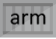

## Artifact Type Approaches

The [OCI Image-spec](https://github.com/opencontainers/image-spec/) provides great flexibility for storing image layers, including the ability to store multi-arch images in a single index. 

While it's possible to store anything in these layers, having deterministic understanding of the type enables great experiences.

Discussions were approached from two angles:

- [Requirements of registries to host new artifact types](./artifactTypeRequirements.md#Registry-Requirements-of-New-Artifact-Types)
- [Requirements of the new artifact type](./artifactTypeRequirements.md#Artifact-Requirements)

Attempting to solve one, without the other would not lead to the goal: **All OCI compliant registries are capable of supporting new artifacts.** 

The following approaches were discussed:

- [Manifest & Index to represent new types](#Manifest-and-Index)
- [Extending `Index.mediaType`](#Extending-`Index.mediaType`)
- [Decoupling Persistance from Artifact Type](#Decoupling-Persistance-from-Artifact-Type)
- [Copying mediaType for additional artifacts](#Copying-mediaType-for-additional-artifacts)
- [Using annotations for additional artifacts](#Using-annotations-for-additional-artifacts)
## Manifest and Index

When looking to leverage the [OCI image-spec](https://github.com/opencontainers/image-spec/), two top level objects were considered:

- [OCI Mmanifest](https://github.com/opencontainers/image-spec/blob/master/manifest.md): 
  Represents a specific artifact, usually specific to a platform and architecture.
- [OCI Index](https://github.com/opencontainers/image-spec/blob/master/image-index.md): Represents a collection of artifacts, typically pivoted on a platform and architecture. For container images, a windows, linux and arm version could be listed. 

Consumers can express either a manifest or an index by a `:tag` reference:

- `demo42.azurecr.io/samples/images/hello-world:1.0`

The above reference could represent windows, linux, arm, or it could represent a multi-arch image. 

Additional tags might be represented as:
- `demo42.azurecr.io/samples/images/hello-world:1.0-windows`
- `demo42.azurecr.io/samples/images/hello-world:1.0-linux`
- `demo42.azurecr.io/samples/images/hello-world:1.0-arm`

In this case, executing `docker run demo42.azurecr.io/samples/images/hello-world:1.0` will cause the docker client to pull the manifest for the `:1.0` reference. Since this is a multi-arch manifest, the docker client will process the manifest, find the platform that matches, and make a subsequent request for the digest that represents: `demo42.azurecr.io/samples/images/hello-world:1.0-linux`

This flow works well for multi-arch scenarios. The index represents a collection of images. 

### Registry Listing
A registry listing, could be visualized as:

| tags | icon[s] | type | actions|
|-|-|-|-|
| `samples/image/hello-world:1.0` |  | container image | `docker run ...` |
| `samples/image/hello-world:1.0-windows` || container image | `docker run ...` |
| `samples/image/hello-world:1.0-linux` || container image | `docker run ...` |
| `samples/image/hello-world:1.0-arm` || container image | `docker run ...` |

A few approaches were considered to leverage Index as the type definition. However, there were two problems:

- The [OCI Index spec](https://github.com/opencontainers/image-spec/blob/master/image-index.md) doesn't have an existing deterministic extensibility point to define new artifact types.
- The examples discussed to date, fit within a manifest definition, leveraging config and layers.

### Extending `Index.mediaType`

There was discussion on extending the `application/vnd.oci.image.index.v1+json` `mediaType` on Index to accept new values. However it was felt to be to impacting as the `oci.image.index` `mediaType` is well understood by registries and tooling.

### Decoupling Persistance from Artifact Type
Another approach for [Decoupling Persistance from Artifact Type](https://github.com/SteveLasker/RegistryArtifactTypes/tree/artifactType) proposed adding a new required property `artifactType` that allowed mediaType to represent persistance, while a new property would represent the specific type. The belief was it was minimally impacting as each artifact tool would simply supply the value, and tools that see `artifactTypes` they don't support would simply ignore them. However, it was also viewed as too impacting to existing OCI tools. 

### Copying mediaType for additional artifacts

While several discussions have considered copying the existing [oci mediaTypes](https://github.com/opencontainers/image-spec/blob/master/media-types.md) to represent different artifact types, this approach conflates the persistence format with the actual artifact type. 

- ` "mediaType": "application/vnd.cncf.helm.chart.v1+json" `
- ` "mediaType": "application/vnd.deislabs.cnab.chart.v1+json" `

Expanding the media types requires registries to understand these new media types and how to validate them.

### Using annotations for additional artifacts

Other options considered [annotations](https://github.com/opencontainers/image-spec/blob/master/annotations.md) to describe the new artifact. 

```json
"annotations": {
    "io.cnab.component_name": "component-2",
    "com.docker.app.format": "cnab",
    "io.cnab.keywords": "[\"keyword1\",\"keyword2\"]",
    "io.cnab.runtime_version": "v1.0.0-WD",
    "io.cnab.type": "io.docker.app",
```

Annotations are great for optional search results and details of an artifact. However, annotations are optional, making it a little too unstructured to provide deterministic definitions of the objects within a registry.

A docker client, or other client that expects to pull Images could pull a digest or tag and fail. The existing clients know how to parse the mediaType, and if they see a mediaType the don't recognize, they know to ignore it. 

While annotations can be fit within the pre-release OCI image-spec, it's proposed this is the time to evolve the spec to decouple persistance formating from artifact declaration.

