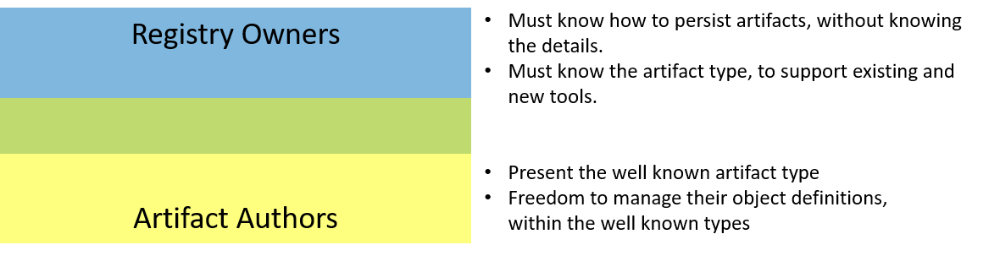

# New Artifact Requirements

If we assume registries can host various artifact types, the next set of question include:

- How does one reason over the various artifact types in a registry?
- How would a registry listing represent the different artifact types? 
  - Can a registry show an icon and/or a short text identifier? 
- If a registry listings wishes to provide optimized action points, such as gestures to deploy Helm Chart, ecs task, or deploying an image directly to a container service; how would the UI know which actions to surface on which artifact types?
- How would vulnerability scanners know how to scan the various artifacts? Would scanners perform different scanning routines, based on the artifact type? How do they know the type?

## Requirements 
Adding new artifacts to an OCI registry involves requirements from two distinct groups.

- [Requirements of registries to host new artifact types](#Registry-Requirements-of-New-Artifact-Types)
- [Requirements of the new artifact type](#Artifact-Requirements)




## Registry Requirements of New Artifact Types

To provide great customer experiences, leveraging the infrastructure implemented to support container images, registry providers have the following requirements:

- [Deterministically understand artifact types](#Deterministically-Understanding-Artifact-Types), without having to pull and parse layers.
- [Fit within the existing persistance capabilities](#Fit-Within-Existing-Persistance-Formats) of **oci distribution**
- [Support existing and new registry clients](#Support-Existing-and-New-Registry-Clients)
- [Minimal engineering impact to support new artifact types](#Minimal-Engineering-Impact-to-Support-New-Artifact-Types)

### Deterministically Understanding Artifact Types
Registries must be able to efficiently and deterministically understand the type represented by each `:tag` and `@digest`.

A simplified example of a registry listing might look like:

| artifact reference | icon | type | actions|
|-|-|-|-|
| `samples/image/hello-world:1.0` | | container image index| `docker run ...` |
| `samples/image/hello-world:1.0-windows` || container image | `docker run ...` |
| `samples/helm/hello-world:1.0` ||  helm chart | `helm install ...` |
| `samples/cnab/hello-world:1.0` || CNAB | `duffle install ...` |
| `samples/arm/hello-world:1.0` || arm | `az deployment create ...` |
| `samples/ecs-task/hello-world:1.0` || ecs-task | `aws ecs create-service ...` |

Existing registry listing APIs must be able represent the type.

**Example CLI based registry listing:**
```sh
az acr repository show-tags --repository image/hello-world

Repository: image/hello-world
Tag     Type
---------------
1.0     image

az acr repository show-tags --repository helm/hello-world

Repository: helm/hello-world
Tag     Type
-------------
1.0     helm
```

### Fit Within Existing Persistance Formats
Registries support container images, and APIs assume all objects in a registry represent one of three things:

- [**Index**](https://github.com/opencontainers/image-spec/blob/master/image-index.md) - A collection of images (manifests), differentiated by architecture and platform
- [**Manifest**](https://github.com/opencontainers/image-spec/blob/master/manifest.md) - A single image, targeting a specific architecture and platform. 
- [**Layer**](https://github.com/opencontainers/image-spec/blob/master/manifest.md#image-manifest-property-descriptions) - Represented as an [OCI descriptor](https://github.com/opencontainers/image-spec/blob/master/descriptor.md), represents a persisted blob that can be push, pulled and cached on a client. 

### Support Existing and New Registry Clients
Registries already support multiple clients, including:

- **docker clients**, pushing and pulling images through `docker push/pull`
- **Registry Tools**, such as vulnerability scanners that query, pull & scan images through cloud implementations of [the catalog api](https://docs.docker.com/registry/spec/api/#catalog)
- **CI/CD** solutions, such as [Codefresh](https://codefresh.io), [Azure Pipelines](https://azure.microsoft.com/services/devops/pipelines/), [Jenkins](https://jenkins.io/), [CircleCI](https://circleci.com/) and others that utilize cloud specific versions of [docker webhooks](https://docs.docker.com/docker-hub/webhooks/) ([acr](https://docs.microsoft.com/en-us/azure/container-registry/container-registry-webhook), [ecr](https://docs.microsoft.com/en-us/azure/container-registry/container-registry-webhook), [gcr](https://cloud.google.com/container-registry/docs/configuring-notifications), [quay](https://docs.quay.io/guides/notifications.html))

Existing clients assume the objects being returned are container images. 

As new artifacts are `pushed`, `events fired`, discovered through `catalog` & `search` APIs and `pulled`; the registry MUST be able to identify the specific artifact.

### Minimal Engineering Impact to Support New Artifact Types

New artifacts will span from the largely supported scenarios of Helm charts, to smaller niche or cloud specific implementations, such as [msix](https://docs.microsoft.com/en-us/windows/msix/overview) or [ecs tasks](https://docs.aws.amazon.com/AmazonECS/latest/developerguide/task_definitions.html).

To provide a level playing ground, registry providers should have a minimal configuration change to support new artifact types. 

## Artifact Requirements

To benefit from OCI compliant artifact registries, existing and new artifacts require:

- [Artifact persistance](#Artifact-Persistance), with flexibility to store artifact specific types, or pointers to existing registry artifacts
- [Clear guidance](#Clear-Guidance) and expectations for being supported by OCI compliant registry providers.
- [Authorization](#Authorization), enabling artifact CLIs the ability to push and pull artifacts to secured registries. 
- [Ease of support](#Ease-of-Support) by all existing and new OCI artifact registry implementations. 


### Artifact Persistance

To persist an artifact, the following are required:

- Identification of the type
- Configuration information
- Persistance of objects

Extending [`manifest.config.mediaType`](https://github.com/opencontainers/image-spec/blob/master/manifest.md#image-manifest-property-descriptions), artifact owners can identify their unique type.

Artifact owners can utilize the existing [`oci.image.config`](https://github.com/opencontainers/image-spec/blob/master/config.md), or provide their own custom config schema. 


[OCI Image layers](https://github.com/opencontainers/image-spec/blob/master/image-layout.md), provide artifact authors the flexibility to store one or more objects. While OCI Image layers are ordinal, the parsing of the layers is up to the artifact tooling. A registry will serve the requested layers, leaving the details to the artifact tooling.

Registries offer artifact reference in the form of `[registry]`/`[namespace]`/`[artifact]`:`[tag/version]`


## Clear Guidance

Artifact authors are focused on their experience. They want to leverage existing OCI artifact registries with little to no changes required by each registry to support their type.

A set of runnable examples, with tests must be provided, enabling a rich ecosystem of supported artifacts.

## Authorization

To provide artifact tooling the ability to operate independently of other tooling, they must be able to provide authorization to pull the artifact. 

While there's a user goal for enabling authentication, it's unclear if it's feasible to provide a cloud agnostic solution for authentication. 

## Ease of support

To support a vibrant ecosystem, it must be easy for registries to support new artifact types. 

To avoid "junk drawer" like scenarios, where registries store arbitrary objects without having knowledge of what the types are, registries will likely limit the types they support to known types.

To balance the ease for a registry to onboard new types, and the ease for artifact authors to create new types, a basic mapping will be provided.

### Artifact Mappints

By providing a json schema, artifact authors can submit their details to a central artifact repository. Registry owners can ingest the information, copying the icons and strings to their production environment. 

Registry owners are not required to support all artifact types, nor are artifact owners required to submit their information to a central repository. The information sharing is optional, making it easy for artifacts and registries to collaborate. 

**Examples for `OCI Image`, `Helm` and `CNAB`**:
```json
{
    "schemaVersion": 1,
    "mediaTypes": [
        {
            "mediaType": "application/vnd.oci.image.config.v1+json",
            "title": "OCI Image",
            "description": "OCI Image Format",
            "icon.svg": "https://github.com/opencontainers/artwork/blob/master/oci/icon/color/oci-icon-color.svg",
            "icon.png": "https://github.com/opencontainers/artwork/blob/master/oci/icon/color/oci-icon-color.png",
            "moreInfo": "https://www.opencontainers.org/",
            "tools": [
                {
                    "title": "OCI Tools",
                    "installer": "https://github.com/opencontainers/runtime-tools"
                }
            ],
            "schemaValidation": "https://github.com/opencontainers/image-spec/blob/master/schema/config-schema.json"
        },
        {
            "mediaType": "application/vnd.cncf.helm.config.v3+json",
            "title": "Helm Chart",
            "description": "The package manager for Kubernetes",
            "icon.svg": "https://github.com/helm/helm/blob/master/docs/logos/helm-blue-vector.svg",
            "icon.png": "https://github.com/helm/helm/blob/master/docs/logos/helm_logo_transparent.png",
            "moreInfo": "https://helm.sh/",
            "tools": [
                {
                    "title": "Helm",
                    "installer": "https://github.com/helm/helm#install"
                }
            ],
            "schemaValidation": "none"
        },
        {
            "mediaType": "application/vnd.deislabs.cnab.config.v1+json",
            "title": "CNAB",
            "description": "Facilitate the bundling installing and managing of container-native apps",
            "icon.svg": "https://github.com/deislabs/cnab.io/blob/master/themes/cnab/static/img/cnab-icon.svg",
            "icon.png": "https://github.com/deislabs/cnab.io/blob/master/themes/cnab/static/img/logo.png",
            "moreInfo": "https://cnab.io/",
            "tools": [
                {
                    "title": "duffle",
                    "installer": "https://github.com/deislabs/duffle#duffle-the-cnab-installer"
                },
                {
                    "title": "docker-application",
                    "installer": "https://www.docker.com/products/docker-desktop"
                }
            ],
            "schemaValidation": "https://github.com/deislabs/cnab-spec/tree/master/schema/oci-config.json"
        }
    ]
}
```
